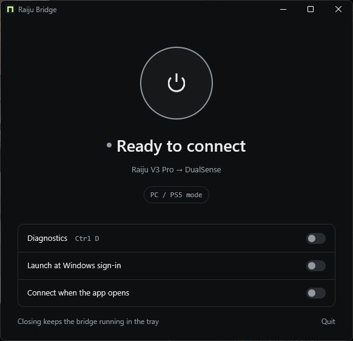
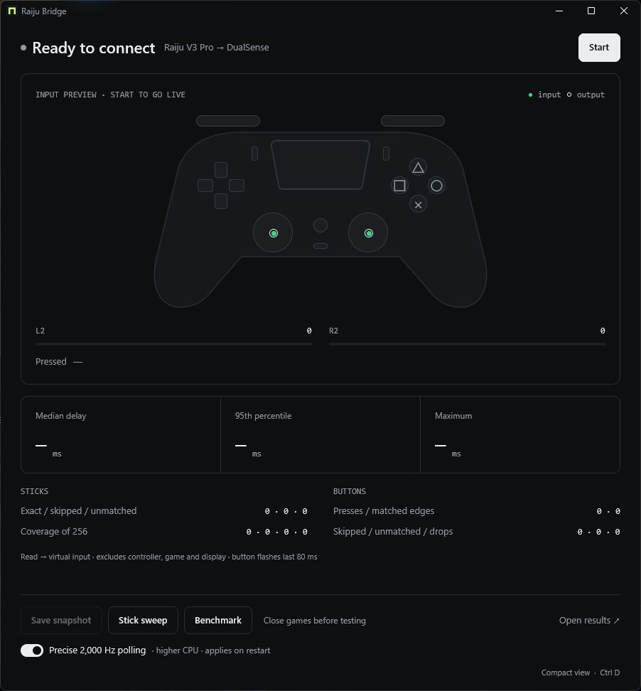

# Raiju Bridge

The Razer Raiju V3 Pro is detected as an Xbox controller in PC mode, so games show Xbox button prompts. Raiju Bridge translates its input into a virtual DualSense, enabling PlayStation button prompts in supported games.

Use PC or PS5 mode with a native Rust/GPUI app, Start/Stop, a tray icon, optional startup, and live button, stick and touchpad diagnostics.

<table>
  <tr><th>Compact</th><th>Diagnostics</th></tr>
  <tr>
    <td valign="top"></td>
    <td valign="top"></td>
  </tr>
</table>

## Install

1. Install the signed [USB/IP driver 0.9.8.1](https://github.com/vadimgrn/usbip-win2/releases/tag/v.0.9.8.1) and restart if requested.
2. Download `raiju-bridge-windows-x64.zip` from **Assets** on the latest [release](https://github.com/luke-z/raiju-bridge/releases) and extract it.
3. **PC mode requires [HidHide](https://github.com/nefarius/HidHide/releases/tag/v1.5.230.0).** Install it, restart if requested, and reopen the bridge. **PS5 mode works without HidHide**; the USB/IP driver is required in both modes.
4. Keep `libVIIPER.dll` beside `raiju-bridge.exe`. Connect one Raiju by USB, open the app, and click the **power button**.

Fresh installs open in compact mode. Use **Diagnostics** or **Ctrl D** to expand the live controller view and measurements. Closing the window keeps the bridge in the tray; **Quit** stops it. Windows sign-in and automatic connection are separate settings.

In PC mode, **Start** automatically allows the bridge through HidHide and hides only the physical Raiju gamepad. **Stop** restores its previous visibility; a helper also restores it if the app crashes. Start the bridge before opening a game so it sees only the virtual DualSense. Existing manual HidHide rules are preserved.

PC mode requires Windows 11 24H2+, a regular mouse, and no other Precision Touchpad. Optional precise 2,000 Hz polling uses more CPU and is **off by default**; enable it in Diagnostics and restart the bridge to apply it. Touchpad contacts and clicks become PlayStation input while cursor movement is suppressed. The original Windows touchpad preference is restored on Stop or app exit, with a watchdog for crashes. Synapse is not needed to run the bridge; existing onboard mappings still apply.

HidHide prevents games from also receiving the physical Xbox input, which can cause Xbox prompts or duplicate input. Rumble, adaptive-trigger feedback and motion forwarding are not implemented. Wired USB has been tested; wireless support is unverified.

## Stick center and deadzone

In our resting captures, the Raiju's PC-mode XInput axes stayed exactly at `0` on a signed `-32768` to `32767` scale. The bridge maps that center to `128` on the DualSense's `0` to `255` scale. Both can represent neutral input: the signed range alone does not guarantee drift-free input, and the unsigned format does not inherently require a deadzone.

If the game cursor creeps at a `0.00` deadzone, try `0.01` (1%). This stopped the observed creep in both bridge modes despite steady resting values. The exact cause remains unconfirmed; a game interpreting `128` relative to a midpoint of `127.5` is only a hypothesis. The bridge adds no stick deadzone or response curve. A game deadzone filters small center inputs; it adds no timed processing delay.

[GPL-3.0-or-later](LICENSE). Uses [VIIPER](https://github.com/Alia5/VIIPER) over localhost USB/IP. No firmware changes or cloud service.
